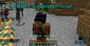

# Mustache Man

## Quick backstory
Me and my friends realised you can `/skin` without logging into the account.   
My good friend [Ciel](https://github.com/Ciel-MC) thought of the name "Mustache Man"

## Acomplishments
<ul>
<li>
    We managed to take down the `#screeny-z-servera` (server screenshots channel) because of the screenshots of ranked (and non ranked) people with the skin.
  </li>
  <li>
    We got a Youtuber to leave the server and we set the skin for him.
  </li>
</ul>

## Downfall
The bug was pretty quickly fixed by the devs - it lasted for about 2 days  
We changes the skins of around 5k players

## Images

